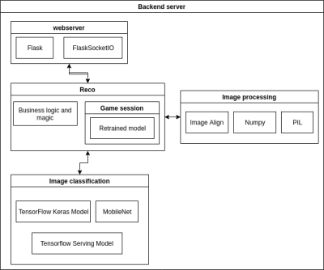

## Image Recognition - Classification

Experimenting with Machine Learning + Image Recognition/Classification + Tensorflow.

The idea of the project was replicate what is [here](https://storage.googleapis.com/tfjs-examples/webcam-transfer-learning/dist/index.html) :

"...
In this example, we'll use a pretrained MobileNet model and train another model using an internal mobilenet activation to predict 4 different classes from the webcam defined by the user.
..."

It's a quick and dirt solution to have Image classification through MobileNet + "transfer learning" technique. All of this, encapsulated into a FlaskSocketIO box with WebSocket as main way of access.
The server is capable of provide real time image classification of images focused on faces.
The images received are processed to crop the face area using some scripts from [here](https://github.com/kpzhang93/MTCNN_face_detection_alignment)

### Image recognition
For image recognition a pretrained MobileNet model was choosed because it's lightweight and fast and furious.

The customized MobileNet model is served through [TensorFlow Serving](https://www.tensorflow.org/tfx/serving/architecture), to gain in performance and enventually on scalability.

The overview of the server is:

### Deploy

There is a Dockerfile to deploy the project with docker and a bash script to launch TensorFlow Serving

**This was a exploration with technologies, not an actual production code, so, it's a bit messy. I'm cleaning it, but it's still messy**